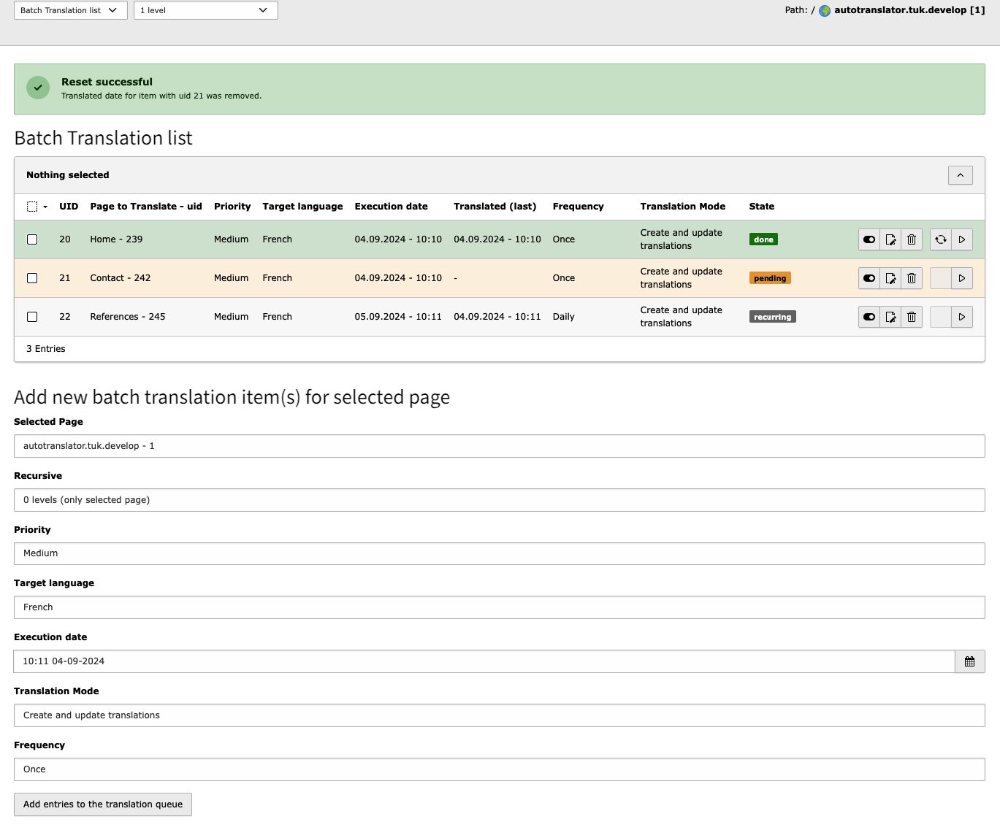
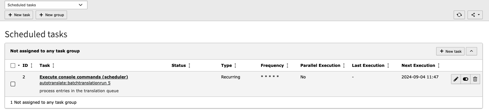

# Batch translation

### Backend Module

Batch translation jobs can be created on the pages via the list view, but it is better to use the backend module.

**Functions of the module**
- Create new translation jobs
- List of translation jobs (by priority)
- Deactivate, delete jobs
- Execute / repeat individual translation jobs
- Reset jobs that have already been completed



### Symfony Command

You have the option of processing the Symfony command in the TYPO3 scheduler and can define how many translation jobs should be processed per run.



You can of course also execute the Symfony command directly via cronjob or via the command line interface of your web server. The argument here represents the number of translations per run.

```autotranslate:batch:run 5```
