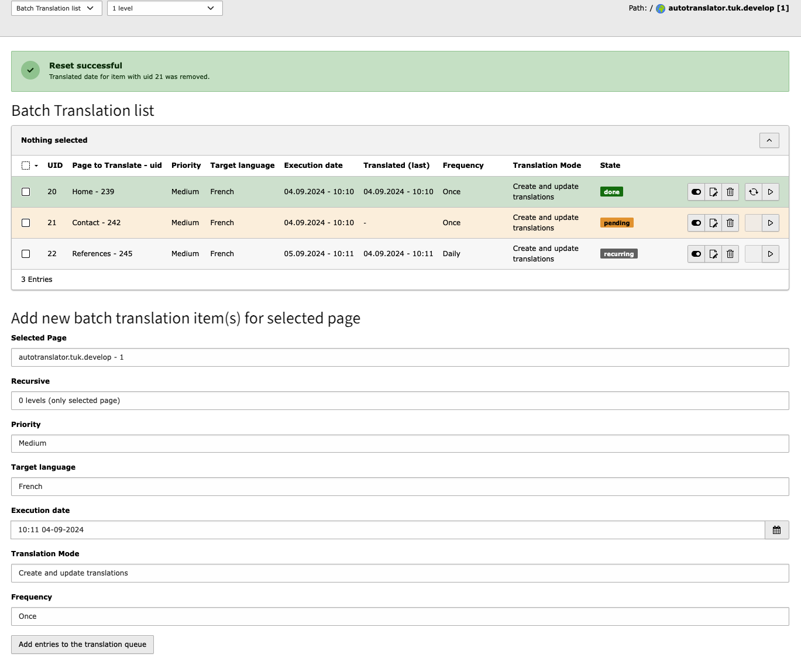
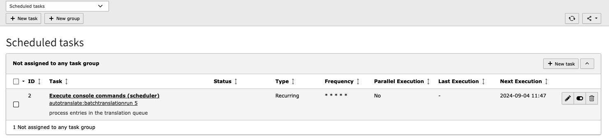

# BatchTranslation

### Backend Module

BatchTranslation jobs can be created on the pages via the list view, but it is better to use the backend module.

**Functions of the module**

- Create new translation jobs
- List of translation jobs (by priority)
- Deactivate, delete jobs
- Execute / repeat individual translation jobs
- Reset jobs that have already been completed



### Symfony Command

You have the option of processing the Symfony command in the TYPO3 scheduler and can define how many translation jobs should be processed per run.



You can of course also execute the Symfony command directly via cronjob or via the command line interface of your web server. The argument here represents the number of translations per run.

```shell
autotranslate:batch:run 5
```

## Translation results and messages

AutoTranslate distinguishes expected no-op results, configuration warnings and actual translation errors. Backend editors receive these results as TYPO3 flash messages. Batch jobs additionally keep their result state in the batch overview.

| Severity | Typical reason | Result / behavior |
| --- | --- | --- |
| Notice | No configured translatable field was changed, or all relevant source values are empty | Completed; the item is not marked as failed |
| Warning | Target languages are selected, but no translatable fields are configured for the table | Completed with warning; the item is not marked as failed |
| Error | A manual or automatic multi-language translation translated at least one language while another language failed | The successful language is kept, while the failed language and its reason are reported as an error |
| Error | Missing DeepL target-language mapping, invalid API key, exhausted quota, API failure or localization failure | The batch item fails and keeps the error details |

Typical messages include:

- Notice: `No configured translatable fields were changed for table tt_content.`
- Notice: `No non-empty field values were translated by DeepL.`
- Warning: `No translatable fields are configured for table tt_content.`
- Error: `No DeepL target language is configured for site language 2.`

Saving a source record without selected AutoTranslate target languages does not start a translation and does not create a flash message. Editing an already localized record does not trigger another automatic translation either.

The `autotranslate_last` timestamp is only updated when DeepL produced at least one translated field. A Notice or Warning caused by a run without translated fields does not update this timestamp.

## Logging

Notice and Warning messages are written to the AutoTranslate log only when **Enable detailed debug logging for Autotranslate** (`general.debug`) is enabled in the extension settings. The corresponding backend flash messages are shown independently of this option.

Error messages are always logged so failed scheduler, CLI and backend runs remain diagnosable. The CLI also writes its regular item-processing status and prints the result of each processed item.
