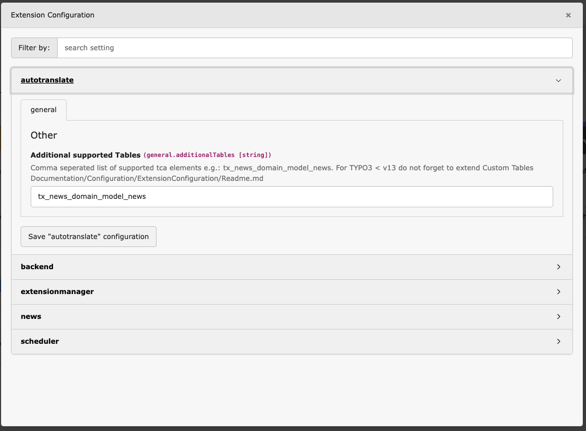

# Extension Settings

Here you can define DeepL API Key and which 3rd party content should be supported.

Use "Additional supported record tables" for regular records such as news or address records.
Use "Additional supported relation tables" for inline/reference child tables such as `sys_file_reference` or Mask item tables.
For nested Content Blocks collections, add the generated collection tables to "Additional supported relation tables".
If one of those relation tables contains file fields, the site configuration exposes a matching `FileReferences` field
where the file relation columns can be selected, for example `level_three_image`.

**After adding tables, a database compare must be performed using the install tool**



### Important: TYPO3 v12 and older

In older TYPO3 versions you have to provide the required fields for the 3rd party tables in your site package via ext_tables.sql.

## Example sql schema for additional tables

Except for tx_news_domain_model_news, here we already provide the sql schema.

```
CREATE TABLE tx_table_name_item (
    autotranslate_exclude tinyint(4) DEFAULT '0' NOT NULL,
    autotranslate_languages varchar(255) DEFAULT NULL,
    autotranslate_last int(11) DEFAULT '0' NOT NULL,
);
```

## Example sql schema for relation tables

Except for sys_file_reference, here we already provide the sql schema.

```
CREATE TABLE tx_table_name_item (
    autotranslate_last int(11) DEFAULT '0' NOT NULL,
);
```

> [!NOTE] If fields from third-party extensions that have allowLanguageSynchronization enabled (tt_address) are to be translated, the backend cache must be cleared once after editing the site configuration.
