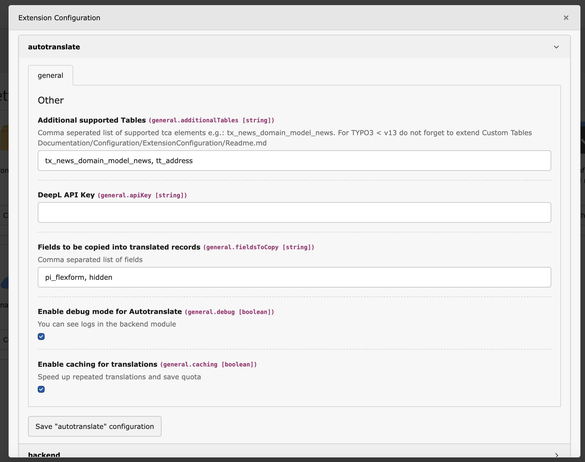

# Extension Settings

Here you can define which 3rd party content should be supported.

**After adding tables, a database compare must be performed using the install tool**



### Important: TYPO3 v12 and older

In older TYPO3 versions you have to provide the required fields for the 3rd party tables in your site package via ext_tables.sql. Except for tx_news_domain_model_news, here we already provide the sql schema.

## Example sql schema

```
CREATE TABLE tx_table_name_item (
    autotranslate_exclude tinyint(4) DEFAULT '0' NOT NULL,
    autotranslate_languages varchar(255) DEFAULT NULL,
    autotranslate_last int(11) DEFAULT '0' NOT NULL,
);
```
