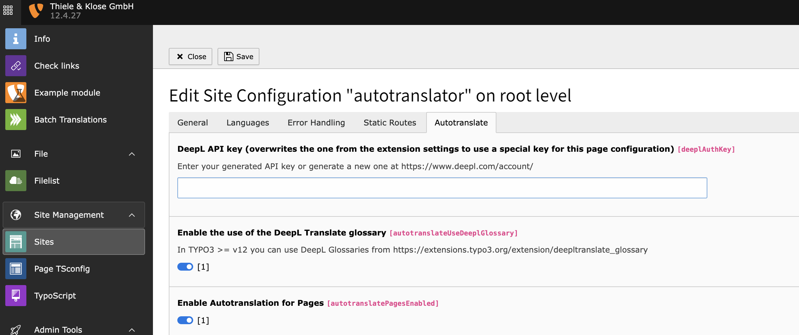
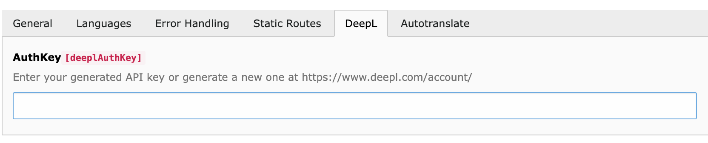
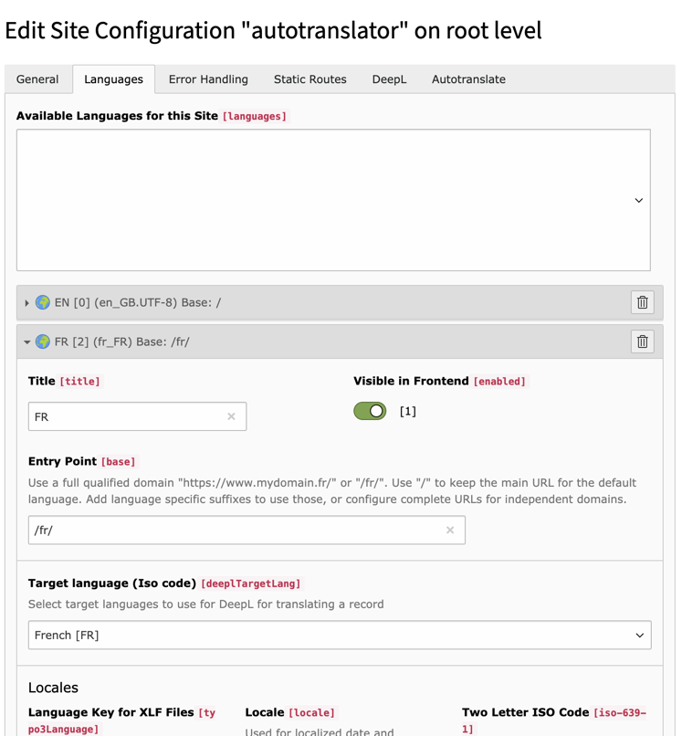
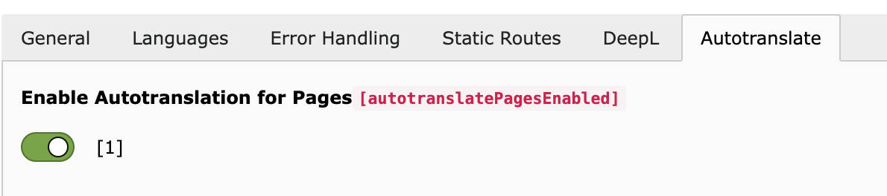
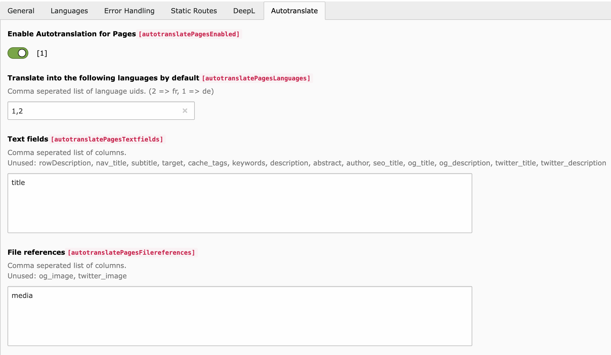

# Configuration

### Site configuration

The basic configuration must be done via the TYPO3 page configuration.

### DeepL API-Key

The DeepL API key can be configured in the site configuration module under the DeepL tab.

### Translatable Languages

You have to set the DeepL target language for each language to be translated.

### Translatable types

You can choose for which of the supported content types (pages, tt_content, news) the automatic translation should be active.

### Example configuration for page

In the example, translations for pages are active. The title of the pages and files of the Media type is translated into German and French.

### Further information

* [Language](TranslatableElements/Languages.md)
* [Text fields](TranslatableElements/TextFields.md)
