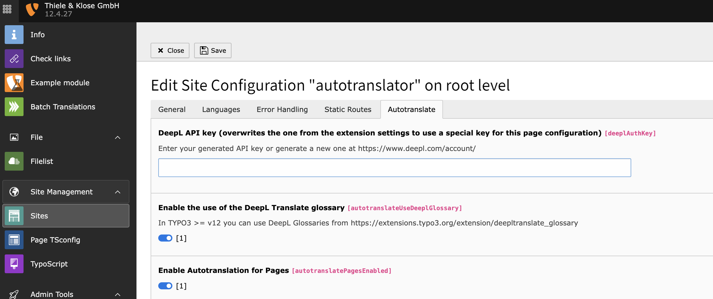
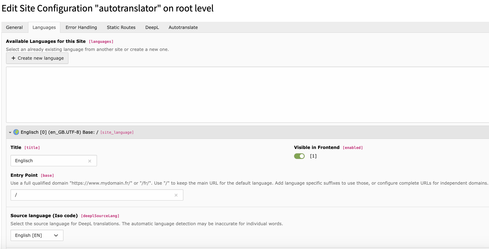
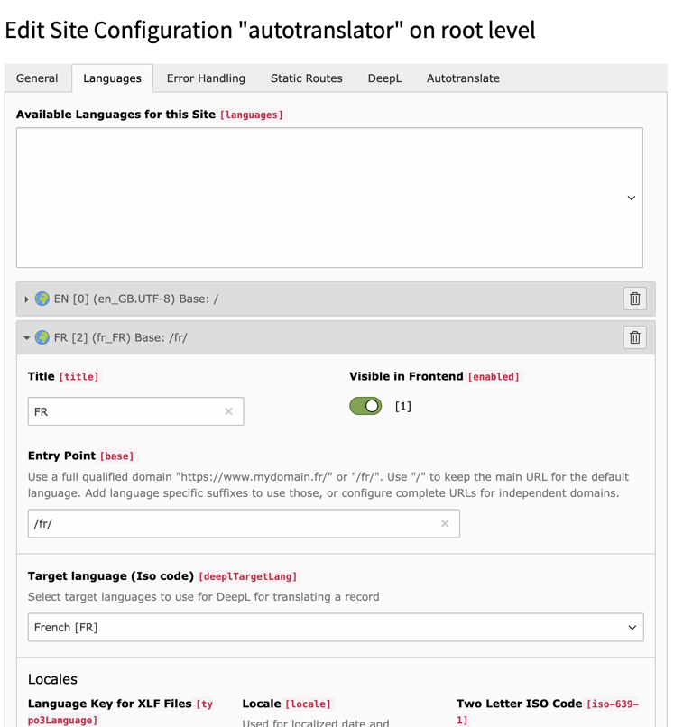
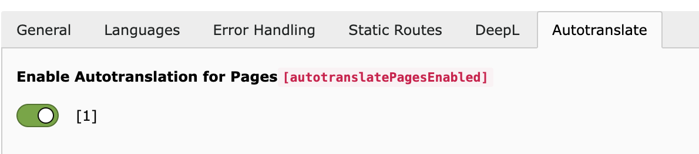
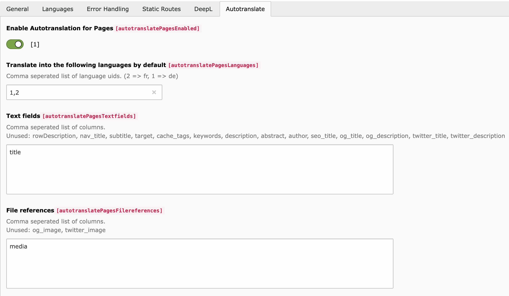

# Site Configurations

The basic configuration must be done via **Site Management / Sites / Autotranslate**.

### Translatable Languages

You should set the DeepL source language to your base language, otherwise DeepL will try to detect it based on the text to be translated. (since v1.1.1)

You have to set the DeepL target language for each language to be translated.

If glossary support is enabled, the source language must be configured explicitly. DeepL glossaries require both source and target languages.

### Translatable types

You can choose for which of the supported content types (pages, tt_content or additional tables configured in [extension settings](../ExtensionConfiguration/Readme.md)) the automatic translation should be active.

### Example configuration for page

In the example, translations for pages are active. The title of the pages and files of the Media type is translated into German and French.

### Glossary support

Glossary support can be enabled in the site configuration when `deepltranslate_glossary` is installed.

For troubleshooting synchronized glossaries and the `glossary_ready` state, see [Glossary Support](../Glossary/Readme.md).

### Record-level exclusion

Individual pages, content elements and configured additional record tables can be excluded from automatic translation on the record itself.

For details, see [Excluding Records](../ExcludingRecords/Readme.md).
