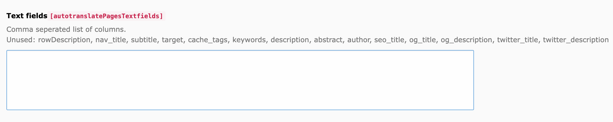
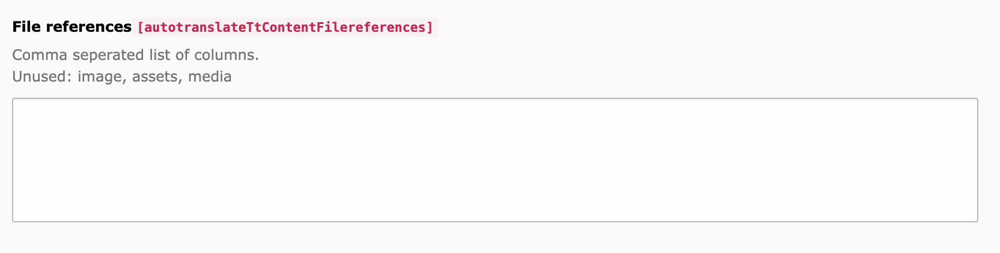
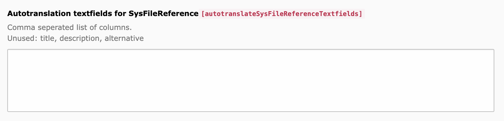

# Fields to be translated #

You must specify which fields you want the service to translate. 

The service reads possible fields from the TCA and suggests them. The fields must be entered in the text box separated by commas. Entered fields are filtered out of the suggestion.

You must define what types of files should be translated by the service.

You can also define text fields of the files to be translated.

