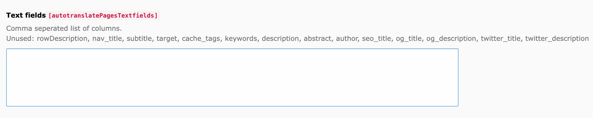
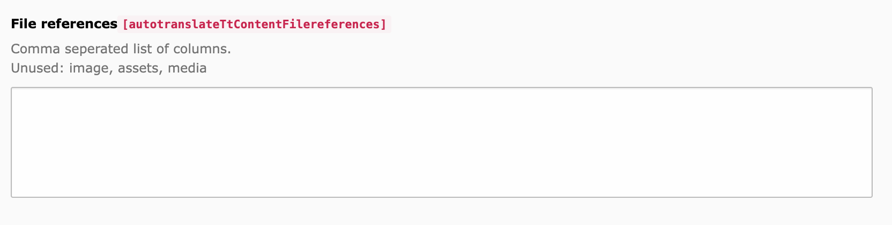
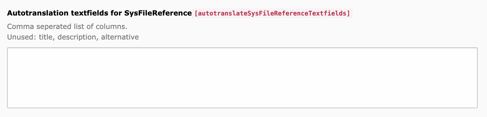

# Fields to be translated

You must specify which fields you want the service to translate.

The service reads possible fields from the TCA and suggests them. The fields must be entered in the text box separated by commas. Entered fields are filtered out of the suggestion.

## FlexForm fields

TCA columns with `config.type = flex` can be added to the text fields configuration like regular fields, for example `pi_flexform` or a custom FlexForm column.

Inside configured FlexForm columns, AutoTranslate translates FlexForm child fields whose FlexForm data structure defines one of these field types:

- `input`
- `text`

Rich text FlexForm fields are supported when the child field config enables richtext, for example with `enableRichtext = 1`. These values are sent to DeepL with HTML handling enabled.

Non-text FlexForm child fields are skipped, including checkboxes, select fields, numeric fields and link fields such as `renderType = inputLink` or `softref = typolink`.

If a FlexForm column is also listed in the extension setting **Fields to be copied into translated records**, the translated value takes precedence whenever translatable FlexForm child values are found. Otherwise, the original FlexForm value can still be copied unchanged.

You must define what types of files should be translated by the service.

You can also define text fields of the files to be translated.

