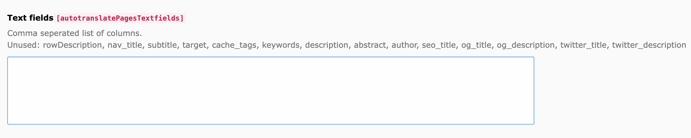
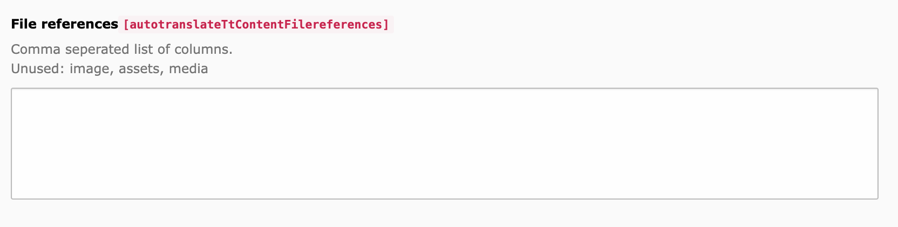
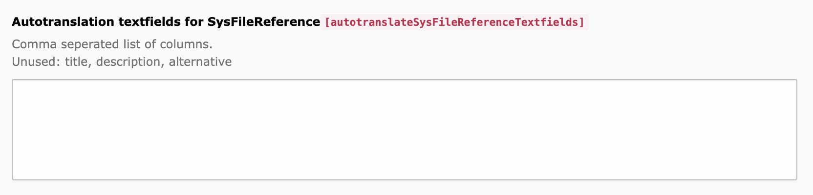

# Fields to be translated

You must specify which fields you want the service to translate.

The service reads possible fields from the TCA and suggests them. The fields must be entered in the text box separated by commas. Entered fields are filtered out of the suggestion.

## Translated page slugs

The `slug` field is not a DeepL text field. AutoTranslate generates it from the translated page title using TYPO3's slug configuration. Enable **Update source and translated page slugs when their titles change** in the site configuration: changing a source page's slug generator field such as `title` regenerates its slug even when that page has no `autotranslate_languages` selected. A batch translation of the page title also regenerates the source slug. When automatic translation runs, AutoTranslate regenerates the translated slug after translating the title. This can replace manually customized slugs. AutoTranslate saves new slugs through TYPO3's DataHandler; when EXT:redirects is installed and `settings.redirects.autoUpdateSlugs` is enabled, TYPO3 also updates subpage paths in the same language.

The command regenerates slugs for the selected default-language pages from their current titles, then repairs obsolete parent paths in existing translations. This also replaces manually customized default-language slugs. No content is translated again:

```shell
vendor/bin/typo3 autotranslate:slugs:repair 123 --languages=1,2 --levels=2 --dry-run
vendor/bin/typo3 autotranslate:slugs:repair 123 --languages=1,2 --levels=2
```

`--levels=0` includes only page 123; `1` includes its children and `2` includes its grandchildren. The default-language slug is regenerated for every included page regardless of `--languages`. Omit `--languages` to repair all existing target-language page records. Translated pages retain their own path segment; pages without a translated parent are skipped. The command can also be added to TYPO3's Scheduler as an **Execute console commands** task.



## FlexForm fields

TCA columns with `config.type = flex` can be added to the text fields configuration like regular fields, for example `pi_flexform` or a custom FlexForm column.

Inside configured FlexForm columns, AutoTranslate translates FlexForm child fields whose FlexForm data structure defines one of these field types:

- `input`
- `text`

Rich text FlexForm fields are supported when the child field config enables richtext, for example with `enableRichtext = 1`. These values are sent to DeepL with HTML handling enabled.

Non-text FlexForm child fields are skipped, including checkboxes, select fields, numeric fields and link fields such as `renderType = inputLink` or `softref = typolink`.

If a FlexForm column is also listed in the extension setting **Fields to be copied into translated records**, the translated value takes precedence whenever translatable FlexForm child values are found. Otherwise, the original FlexForm value can still be copied unchanged.

You must define what types of files should be translated by the service.



You can also define text fields of the files to be translated.


