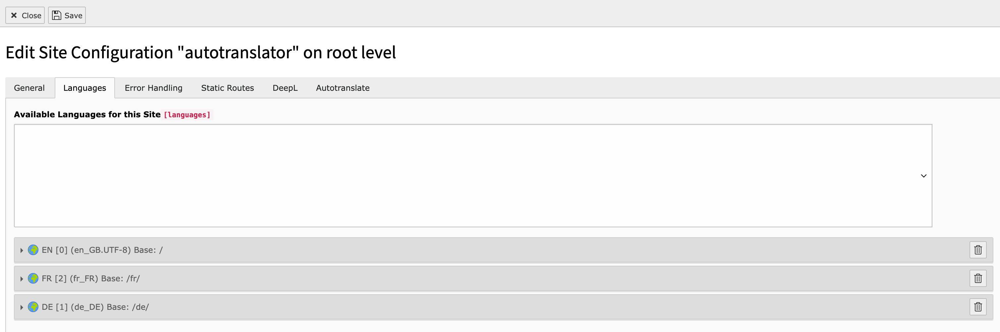
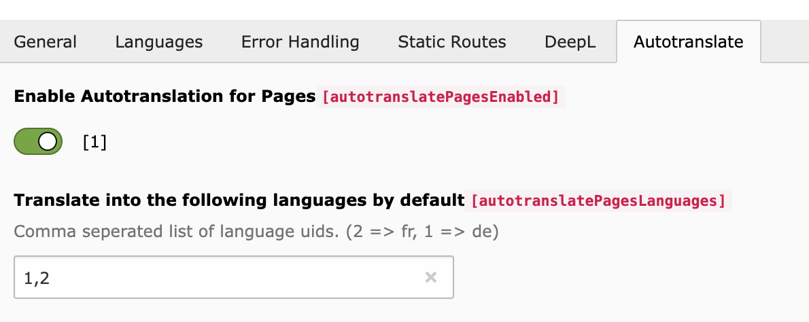

# Languages

The languages defined on the configuration tab "languages" form the basis of the available target languages.

Under the "Autotranslate" tab, the target language into which the content is to be translated by default can be specified for each supported type.

Only the previously defined target languages of the page configuration are suggested as defaults.

The UIDs must be entered in the text field separated by commas.

